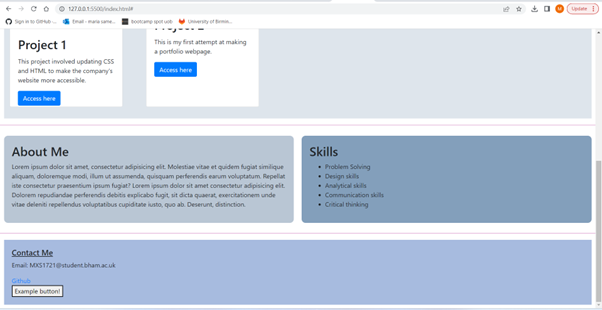

# Maria-Bootstrap-Portfolio

## Description

I wanted to create a portfolio showcasing the work I have created during my time on the University of Birmingham Bootcamp course. This will allow me to see how my skills have progressed over time and show improvements along the way. I have gained more practise on html, css and learnt how to implement bootstrap.

## Usage

This webpage shows a portfolio that includes a navbar and links to previously deployed pages.

    
    
    
    Deployed link: https://maria-sameen.github.io/Maria-Bootstrap-Portfolio/

